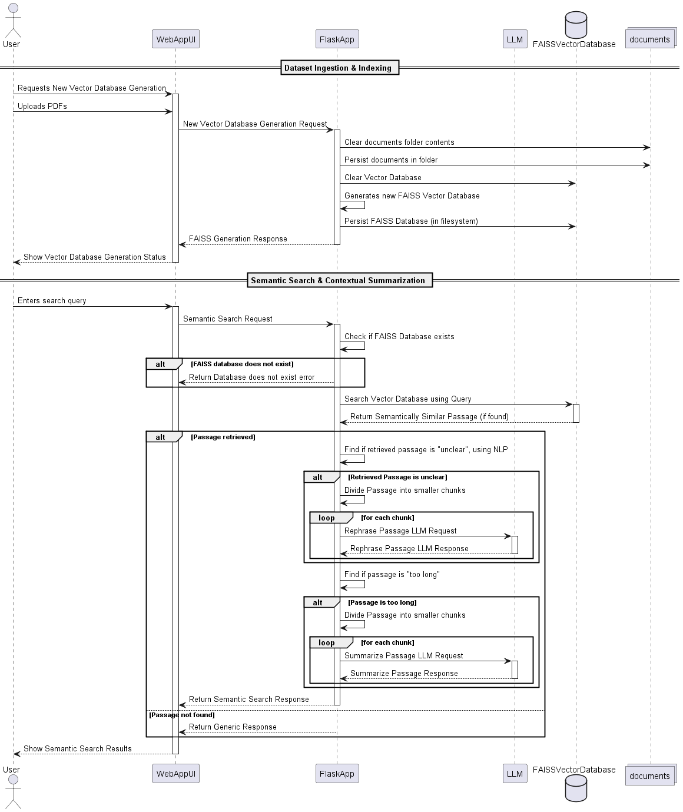

<!-- PROJECT LOGO -->
<br />
<div align="center">
<h3 align="center">DeepContext</h3>

  <p align="center">
    LLM-Powered Contextual Search & Summarization
  </p>
</div>

<!-- TABLE OF CONTENTS -->
<details>
  <summary>Table of Contents</summary>
  <ol>
    <li>
      <a href="#about-the-project">About The Project</a>
      <ul>
        <li><a href="#problem-statement">Problem Statement</a></li>
        <li><a href="#solution">Solution</a></li>
        <li><a href="#sequence-flow-diagram">Sequence Flow Diagram</a></li>
        <li><a href="#built-with">Built With</a></li>
      </ul>
    </li>
    <li>
      <a href="#getting-started">Getting Started</a>
      <ul>
       <li><a href="#running-the-api-without-installation-using-docker">Running the API without Installation (Using Docker)</a></li>
        <li><a href="#running-the-api-using-installation">Running the API using Installation</a></li>
      </ul>
    </li>
    <li><a href="#usage">Usage</a></li>
    <li><a href="#contact">Contact</a></li>
  </ol>
</details>

<!-- ABOUT THE PROJECT -->

## About The Project

LLM-Powered Contextual Search & Summarization

A system that enhances document search and summarization using an LLM-powered feature.

### Problem Statement

Organizations typically deal with a large number of documents (PDFs), and they want a way to enhance their search functionality by:

1. Indexing documents in an efficient way.
2. Allowing semantic search (not just keyword-based) on those documents.
3. Summarizing relevant sections dynamically.
4. Optimizing cost by reducing unnecessary LLM calls.

### Solution

1. The solution will be implemented using an API.
2. There will be 2 endpoints in the API -
   2.1 `/ingestion` endpoint - used to upload PDFs and create a new `FAISS` Vector Database.
   2.2 `/search` endpoint -used to query text and bring up relevant paragraphs.
3. If the retrieved paragraph is `unclear`, the API will do an LLM call to rephrase the paragraph.
4. If the paragraph is `length`, the API will do an LLM call to summarize the paragraph.
5. The `summary_length` will be one of the parameters given to search endpoint, in-case the retrieved paragraph is to be summarized.
6. Edge-Cases -
   6.1 What if the paragraph to be sent to LLM for rephrasing/summarization is too long?
   To handle this case, we will iteratively divide the paragraph into chunks of certain size, with some sentences overlap between them. In each LLM call, we will ask the LLM to consider the previous response and do the task for the current chunk. At the end, we will join the individual responses to get a collective response. To specify `chunk_size` and `sentences_overlap`, a file is provided in the `constants` folder.

7. A file in `constants` folder has been provided to dynamically provide values for -
   Minimum Threshold score for relevant passage,
   Generic message to be given out when no relevant passage is found,
   Minimum length of paragraph for it to be considered for summarization,
   Maximum size content to be sent to LLM etc

### Sequence Flow Diagram

<div align="center">
    
</div>

### Built With

- Python
- OpenRouter
- Flask
- LangChain
- HuggingFace
- PyMuPDF
- FAISS
- OpenAI API
- Textstat
- NLTK
- Spacy

<!-- GETTING STARTED -->

## Getting Started

Please clone the git project, into your machine.
To start, we will be needing -

- Python
- Java
- Postman
- Docker

### Running the API without Installation (Using Docker)

- There is a dockerfile present inside the `server` folder.
- Navigate inside `server` folder.
- Generate a Docker Image using -
     ```sh
     docker build -t deepcontext-api .
     ```
- Now enter the command -
     ```sh
     docker run -p 5000:5000 deepcontext-api
     ```
- Voila! Now the API is running on port `5000`
- The PostMan Collection provided inside the `tests` folder can be used to test the API.

### Running the API using Installation

To start, we will be needing -

- Navigate to `server` folder and run -
     ```sh
     pip install -r requirements.txt
     ```
- Navigate to `src` folder and run -
     ```sh
     pip install -e .
     ```
- Make an account on OpenRouter and generate an API key.
- Navigate to `config` folder insider server and add this -
     ```sh
     LLM_SECRET_KEY="**your-api-key**"
     ```
- Now, to run the app -
  `sh
flask --app deepcontext run
`
- Voila! Now the API is running on port `5000`
- The PostMan Collection provided inside the `tests` folder can be used to test the API.

## Usage

_For usage, you can refer to the PostMan Collection present in the `tests` folder_

Don't forget to give the project a star! Thanks again!

<!-- CONTACT -->

## Contact

Shivam Shukla -
Email: shuklshiva@gmail.com
LinkedIn:
Project Link: [https://github.com/lastropy/DeepContext](https://github.com/lastropy/DeepContext)
